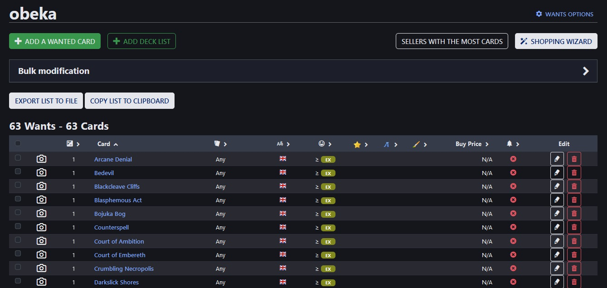

# Overview
Simple [Tampermonkey](https://www.tampermonkey.net/) script for extracting lists of cards from [Cardmarket](https://www.cardmarket.com/en/Magic).  
The script adds a button for extracting the list to file and a button for copying the list to clipboard.  
The buttons appears attached to every table that contains cards, on the following pages:
* Wants List
* Order History
* Shopping wizards result
* Shopping Cart

# Presentation


The extracted list has the following format: `1 Card Name`  
Example list:  
```
1 Arcane Denial
1 Bedevil
1 Blackcleave Cliffs
1 Blasphemous Act
1 Bojuka Bog
1 Counterspell

```

Currently, the list returns only the quantity of the cards and the displayed card name. In the case of Cardmarket being run with different localization settings than English, the names of the cards would also be translated.

# Development
Features to be considered in the future:
* Add support for the rest of the fields that can be found in the Cardmarket tables
    * `Expansion` parameter - translate the name into its abbreviation and extract the card number
        * Would require scryfall integration
    * `Foil` parameter - might want to differentiate between foil types
* Add support for customizing the list output